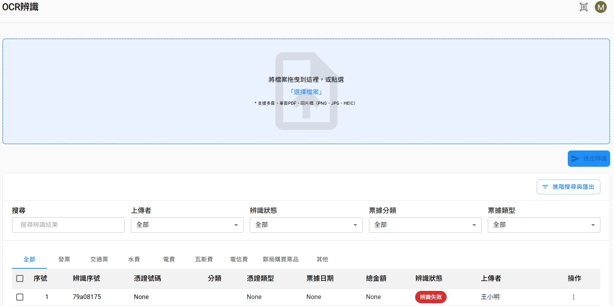

# RBAC後臺專案架構文件

# 專案架構

本文件描述 **RBAC**前端專案的整體架構、資料流與關鍵設計決策（內部的資料及截圖均為mock data）。

---

## 1. 專案概述

本專案為基於 **Next.js（App Router）** 與 **React Admin** 的後台管理系統，主要提供：

- **RBAC（角色權限）**：組織、部門、使用者、角色、選單、權限、操作紀錄、LINE/Slack 綁定、產品與訂單等管理。
- **OCR 功能**：多類型票據／單據的辨識結果管理（發票、水電瓦斯、交通票、郵票、電話費、其他等），含上傳、列表、編輯與報表。

後端 API 以 REST 為主，認證採 JWT（access + refresh），前端透過 OpenAPI 產生的 TypeScript client 與自訂 `dataProvider` 與後端對接。

---

## 2. 認證與授權

### 2.1 認證（authProvider）

- **login**：呼叫 `login(username, password)`（實為 email + password），將回傳的 `access`、`refresh` 寫入 `localStorage`。
- **logout**：清除 access/refresh、`last-logo-url`，並 `queryClient.clear()`。

Token 過期判斷與 refresh 邏輯在 `shared/utils/token`（如 `isAccessTokenExpired`、`refreshAccessToken`）；dataProvider 的 `getValidAccessToken()` 會共用同一套 refresh 佇列，避免並發重複 refresh。

### 2.2 授權（權限）

- **超級使用者**：`identity.is_superuser === true` 時，列表與 API 路徑不綁組織（如直接 `resource`），且 `useHasApiPermission` 一律 true。
- **一般使用者**：**按 API 權限控制按鈕，**`useHasApiPermission(method, pathTemplates)` 依 `useMePermissionData()` 與 path 範本（支援 `{id}`）比對，決定是否顯示編輯／刪除等按鈕。

選單可見性由後端「依角色回傳選單」決定（useMeMenuData），前端僅負責依 `frontend_url`解析連結。

---

## 3. 資源Create、Update

- Zod驗證：使用Zod來做表單驗證(Select元件有時是物件，有時是數字(id)→模糊驗證，兩者都會通過Zod檢查)。
- transform function：通過驗證後將所有型別轉成後端支援的型別(統一id或統一物件)。
- unit test：使用vitest來針對每一種資源的驗證及轉換做測試。

---

## 4. 狀態管理與快取

- **伺服器狀態**：以 **TanStack React Query** 為主。
- **快取策略**：`queryClient` 預設 `staleTime: 60 * 1000`、`retry: 1`；各 feature 的 query 可再覆寫 `staleTime` 。
- **React Admin 自身狀態**：列表 filter、pagination、sort 等存在 React Admin store，與 Resource 綁定；部分列表進階篩選使用 `useStore` 或本地 state。
- **Websocket：**進入專案開啟一條Websocket通道並實作心跳連線檢查及斷線重連機制。

---

## 4. 重點功能模組概覽

### 4.1 RBAC

- **組織**：列表、新增、編輯、詳情（含分頁成員、設定、儲存空間、分析）；組織架構圖為 React Flow + dagre 排版，路徑 `/org-flow/:orgId`。
    
    
    
- **角色**：CRUD；新增、編輯頁含權限區（PermissionArea），與選單的 min_perm/max_perm 對應。
    - 權限矩陣：
        
        
        
        角色擁有的選單由所擁有的權限驅動，若該角色滿足選單所設定之最小權限，則顯示該選單，提供最大/最小權限按鈕供使用者一鍵加入。
        
- **選單**：CRUD；選單列表由 `useMeMenuData` 取得，供 SideBar 渲染；權限對應由 `useMenuPermissionMap` 提供。
    
    
    
- **系統儀表板**：CustomRoute `/system-dashboard`，使用 Recharts 等圖表。
    
    
    
    根據使用者權限可選擇儀表板資料範圍(系統、組織、部門、個人)。
    

### 4.2 OCR

- **辨識結果入口**：Resource `users/me/ocr` 對應列表頁，以 tab 區分類型（全部、發票、水、瓦斯、交通、郵票、電、電話、其他等等）。
    
    
    
- **各類型**：各自有 config（欄位定義、列表欄、表單）、列表與編輯頁；部分列表即時更新依賴 WebSocket。
- **上傳與辨識**：UploadArea、OcrRecognizingPopover、全域 listener（useGlobalOcrListener）處理上傳與辨識中狀態並用useStore記錄辨識狀態，使得user可以在其他頁面查看辨識狀態。
    
    
    
- **報表**：CustomRoute `/analysis/ocr/report`（OcrDashboard）。
    
    
    
    根據使用者權限可選擇儀表板資料範圍(系統、組織、部門、個人)。
    

---